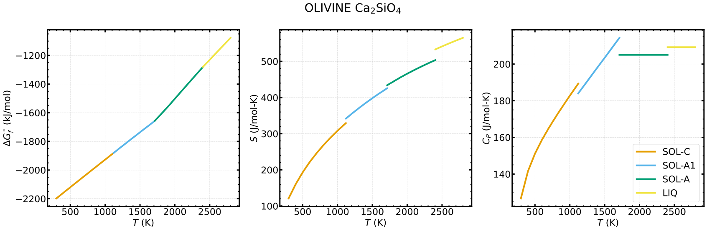
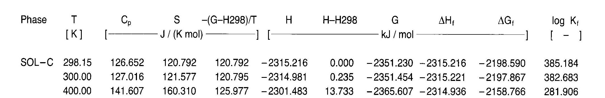

This repository contains parsing and data-structuring tools intended for researchers who hold a legal copy of Ihsan Barin's *Thermochemical Data of Pure Substances* (3rd Edition, 1995). This repository does not distribute any copyrighted text, images, or extracted datasets.

## Example

`read_all_thermodata_pdf.py` OCRs each page's thermodynamic table into structured per-phase data; `query_mp_cifs_from_toc.py` / `query_cod_cifs_from_toc.py` then pair that with a matching crystal structure. Here's what the extracted data looks like for one compound, olivine (Ca<sub>2</sub>SiO<sub>4</sub>), plotted straight from the pipeline's output across all four of its phases (SOL-C, SOL-A1, SOL-A, LIQ):



For reference, here's the column layout Barin's tables use -- cropped to just the header row and two data rows, with no title, formula, page number, or copyright mark, since the source book itself is copyrighted and this repo doesn't redistribute it:



## Setup

Install the dependencies (numpy, pandas, pdfplumber, opencv, pytesseract + the `tesseract` binary, Pillow, tqdm, pymatgen, mp-api) into a single environment. The easiest way is to reproduce the exact, tested environment from `thermodata.yml`:

```
conda env create -f thermodata.yml
conda activate thermodata
```

Then export a free Materials Project API key (from https://next.materialsproject.org/api):

```
export MP_API_KEY=your_key_here
```

Nothing else needs to be edited in any of the scripts below -- paths are resolved relative to each script's own location.

## Pipeline

1. OCR the Barin PDF into per-formula thermodynamic data (the only required CLI input is your local copy of the PDF); this step can take about an hour since it involves OCR:

   `python read_all_thermodata_pdf.py --input-pdf /path/to/local/barin_1995.pdf --output-dir ./barin_json_data/`

2. Retrieve CIF crystal structures for every phase in `toc_barin.csv`, first from Materials Project:

   `python query_mp_cifs_from_toc.py`

3. Then fill in what Materials Project didn't have from the free Crystallography Open Database:

   `python query_cod_cifs_from_toc.py`

   Whatever's left in `cif_unmatched_final.csv` needs a manual lookup in ICSD (no public/scriptable API exists for it).
   
Corresponding crystal structures are first filtered by stoichiometry, using the "Formula" column in `toc_barin.csv`. A match of stoichiometry to a specific phase is then performed:
- Priority is given to known named phases with a hardcoded space group (e.g. $\alpha$-spodumene corresponds with LiAlSi<sub>2</sub>O<sub>6</sub> and has the space group C2/c).
- For some non-stoichiometric compounds (e.g. pyrrhotite, Fe<sub>0.877</sub>S), phase names are instead matched between the "Name" column in `toc_barin.csv` and the "User remarks" listed on the MP entry.
- Otherwise, the crystal structure with the lowest energy above hull among candidates that have an experimentally-verified ICSD match is used; if no candidate has one, the lowest energy above hull among all candidates (including purely computational ones) is used instead. A "theoretical" MP entry doesn't necessarily mean the structure has never been observed -- MP's ICSD linkage isn't fully comprehensive -- but it does mean this pipeline found no independent experimental confirmation for it.

Every generated `.cif` file starts with a `# Source: ...` comment line naming the exact MP ID or COD ID it came from. Look that ID up on [materialsproject.org](https://materialsproject.org) (for MP entries, check the "Experimental Observations" / ICSD IDs on the material's page) or [crystallography.net/cod](https://www.crystallography.net/cod/) (for COD entries) to verify a specific structure's provenance yourself before relying on it. However, *beware* that the incorrect polymorph may be selected in some instances relative to the actual phase whose thermodynamic data is reported in the Barin dataset since this may miss entropically-stabilized high-temperature phases.

The columns containing $`T`$, $`C_P`$, $`S`$, $`H`$, $`G`$ should be trusted the most, since these are the columns with thermodynamic consistency checks and contain the only information needed for the entire temperature-dependent thermodynamics of the standard state for the pure solid, liquid, and gas species -- though the checks on them aren't all the same check. Every accepted row's $`T`$, $`S`$, $`H`$, $`G`$ must satisfy $`G = H - TS`$ and $`dG/dT \le 0`$ within tolerance; a row that doesn't is dropped outright rather than kept with an error (which occasionally drops a handful of genuine data points too, not just OCR errors -- e.g. a phase whose tabulated entropy legitimately goes negative near a decomposition point). $`C_P`$ is checked separately, against the local slope of $`H`$ and $`S`$ in the surrounding rows ($`C_P = \left( \frac{\partial H}{\partial T} \right)_P`$, $`C_P = T \left( \frac{\partial S}{\partial T} \right)_P`$), and is auto-corrected (not dropped) when both agree with each other but disagree with the tabulated value. Thus, beware that the other columns without thermodynamic consistency checks ($`-(G-H_{298 K})/T`$, $`H-H_{298 K}`$, $`\Delta H_f`$, $`\Delta G_f`$, and $`\log K_f`$) may contain some OCR misreads. Unfortunately, there are two entries that appear in the table of contents but never appear in the main body of Barin's 3rd Edition of *Thermochemical Data of Pure Substances* ("Li2S LITHIUM SULFIDE" and "RhCl3[g] RHODIUM TRICHLORIDE (GAS)"). These have been omitted from `toc_barin.csv`.